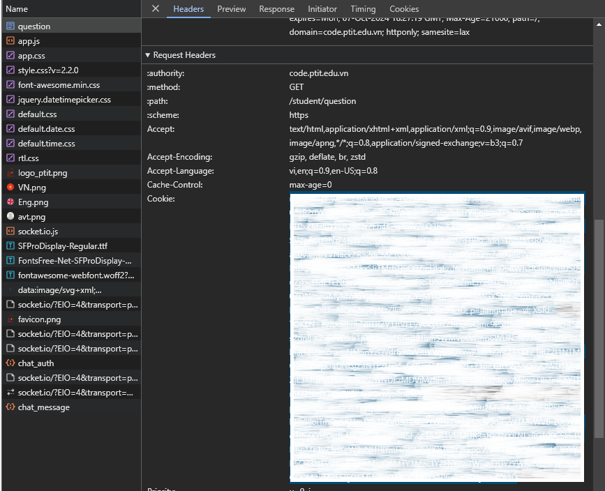

# Codeptit Retriever
- Tool lấy các bài AC trên Codeptit.
- Sử dụng cho cả C, C++, Java, Python.

### Hướng dẫn:
1. Cài đặt NodeJS [tại đây](https://nodejs.org/en) nếu chưa có.
2. Vào thư mục `C:\Users\tên_user_của_bạn`, mở terminal chạy lệnh `npm init -y` để khởi tạo file config.
3. Mở file `package.json`, thêm thuộc tính `"type":"module"`, nếu cài đặt lần đầu kết quả sẽ có dạng như sau:
   ```json
   {
      "type": "module",
      "name": "admin",
      "version": "1.0.0",
      "main": "index.js",
      "scripts": {
         "test": "echo \"Error: no test specified\" && exit 1"
      },
      "keywords": [],
      "author": "",
      "license": "ISC",
      "description": ""
   }
   ```
4. Cài đặt thư viện cần dùng bằng lệnh `npm install node-fetch jsdom`.
5. Đăng nhập vào codeptit. Lựa chọn lớp học (C/C++/Java/Python).
6. F12, vào mục `network` (F5 lại nếu không thấy gì). Lưu ý muốn đổi ngôn ngữ sẽ cần phải lấy lại Cookie.
7. Chọn `question`, trong phần **Request Headers** lấy ra **Cookie** (như trong hình). 
   
8. Mở terminal ở folder chứa file `codeptit.js` và chạy file bằng lệnh `node codeptit.js`.
9. Paste cookie lấy được trên web.
10. Enjoy.

**Note:** Sau mỗi bài sẽ delay 2 giây để tránh bị ban request 429 từ codeptit.